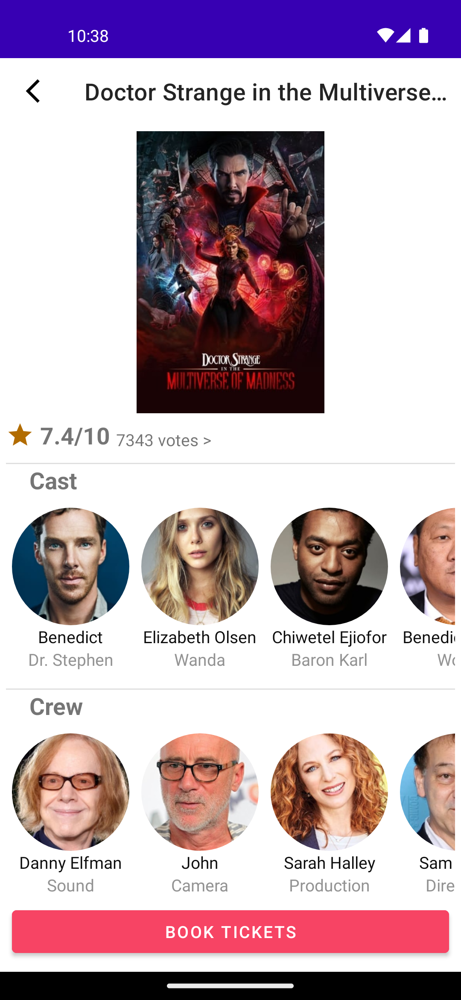

## Multiverse-of-Movies

Get all the details of the movie you like in one place i.e. `Multiverse-of-Movies`. As per the
current implementation, the application has only one screen `MovieDetails`, which shows the data
fetched from `The Movies Database API` [link](https://www.themoviedb.org/).

### MovieDetails Feature Implementation Details:

- The current implementation tries to follow the MVVM architecture.
- Here are package-wise details of working:
    - Application level:
        - Application class which is the entry point for hilt code generation.
        - A `MainActivity` class, which is the launcher activity of the application and this is
          responsible for sending the `movie_id` to and launching the `MovieDetails` screen.
        - `NetworkModule` to provide a `Retrofit` instance required to make API calls.
    - MovieDetails:
        - <b>Models</b> - Defines various modules as per the response schema mentioned in the movie
          database API documentation.
        - <b>API</b> - Defines an interface representing the API endpoints and provides Retrofit
          implementation of the same via `MovieNetworkModule`. Basically, this module handles the
          responsibility of talking to remote data source.
        - <b>Repository</b> - This acts as the abstraction over the various data sources(local,
          disk, remote, etc), but for now, we have only one i.e. API. `MovieDetailsRepositoryModule`
          provides the implementation of `MovieDetailsRepository`.
        - <b>UI</b> - This package contains the actual UI and related logic. `MovieDetailFragment`
          talks to and operates on the data collected in `MovieDetailsViewModel`
          from `MovieDetailsRepository`.
    - Booking:
        - This is the package to host a dummy booking activity which will be launched after clicking
          on the book ticktes button in the movie details screen.

### Tried to follow following architectural principles

- Separation of concerns: Every package is simple and has it's unique responsibility.
- Single source of truth: The app is quite small and simple at this point but still follows the
  single source of truth. All the data from the server comes in the API and the data required to UI
  comes from the repository. And also the application flows the Unidirectional Data Flow structure.
- Also all the parts are kept flexible to scale like used dependency injection, kept things modular,
  etc.

Screenshot: 

<video width="240" height="426" controls>
  <source src="./screenshots/video_after_commit_22.webm" type="video/mp4">
</video>
